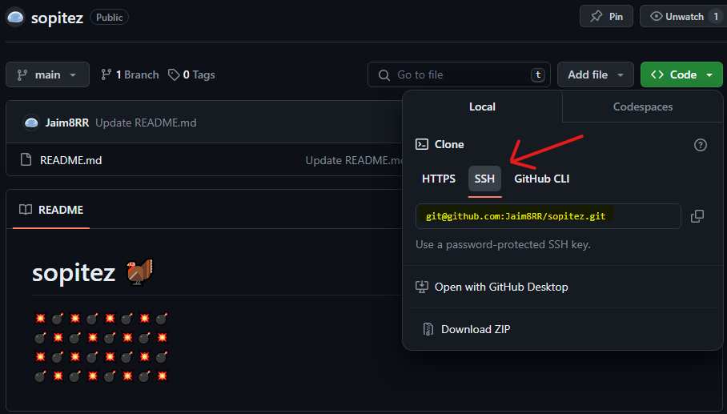
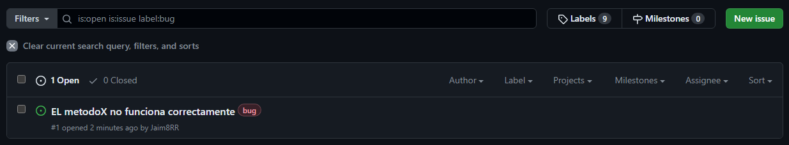
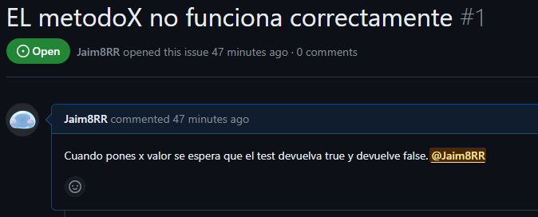
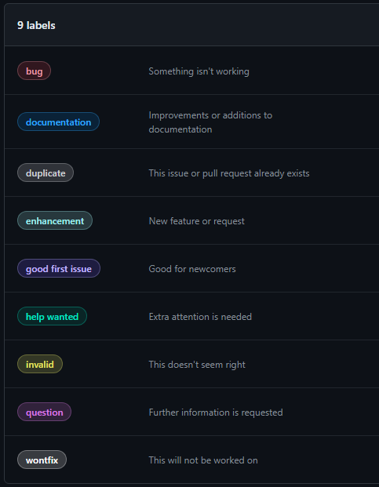
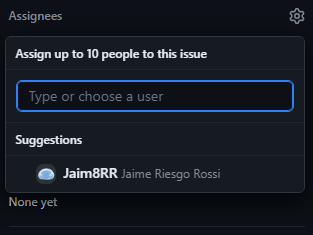

# Contribuir al Trabajo de Gestor de palabras

Trabajo realizado por Daniel Antmann, Alex Gonzaga, Marcos Gilson y Jaime Riesgo.

# Instruciones:

Para contribuir en este trabajo deberás de aceptar la invitación al repositorio que habrás recibido.

## Recuerda tener configurada tu maquina:

Configuración:

```
git config --global user.name "Tu Nombre" → nombre de usuario.
git config --global user.email "tu@email.com" → Correo electrónico.
git config --list → Muestra la configuración actual de Git.
```
## Configuración de Clave SSH en GitHub

Esta guía proporciona instrucciones paso a paso sobre cómo configurar una clave SSH en tu cuenta de GitHub.
Clave SSH
### Paso 1: Verificar si ya tienes una clave SSH

Antes de generar una nueva clave SSH, verifica si ya tienes una ejecutando el siguiente comando en tu terminal:

```
ls -al ~/.ssh
```
#### Si la tienes:
```
cat ~/.ssh/id_rsa.pub
```  
copia el contenido y pasa al cuarto paso.

### Paso 2: Generar una nueva clave SSH

Si no tienes una clave SSH, utiliza el siguiente comando para crearla
:

```
ssh-keygen -t rsa -b 4096 -C "correo@ejemplo.com"
```
### Paso 3: Copiar la clave SSH

cat ~/.ssh/id_rsa.pub

### Paso 4: Meter tu clave SSH en GitHub
En [Github](https://github.com/settings/keys)🔑 podemos poner lo que tenemos copiado al clickar en New SSH Key

## _El Repositorio:_
Para copiar el repositorio se usa el siguente comando:
```
git clone <URL del repositorio>
```
  

Clona un repositorio existente desde una URL.

### _Ramas:_

En principio trabajaremos desde la rama dev y solo mergearemos al main versiones que creamos finales del codigo.  
### Importante:
**Hay que crear una rama con el nombre del cambio(o issue), esta rama es la que luego intentarás hacer un pull request si cumple las condiciones**   
Opcion 1 crea y te cambia a la nueva rama:  
```
git switch -c "Nombre de tu issue o cambio"
```
Opción 2 :   
Te mueves a main
```
git checkout main
```

Creas tu rama
```
git branch nombre_de_tu_Issue
```

Te mueves a tu rama
```
git checkout nombre_de_tu_rama
```
Y haces los cambios que tengas que hacer
```
git commit "nombreDeTuFichero" -m  "tu mensaje ej: X fichero creado/modificado"
```
Solo hay que comitear lo que cambias ni mas ni menos.
## _¿Como contribuir?_

Iremos haciendo una cantidad de "Issues" en git ya sea con cosas que falten por implementar, como por ejemplo:

  
En los Issues se pueden asignar personas para que se encarguen de ellas,es como una lista de **TODO**, de cosas por hacer. No tiene porque ser un problema puede ser una feature o mejora también.


Con el **@NombreDeUsuario** puedes mencionar a alguien y responder a una Issue:



Con los Label puedes asignarle diferentes etiquetas. Puedes incluso crear tú nuevas!  
### Estas son las 9 predeterminadas:



Y tambien podemos assignar a X numero de personas para que resuelvan la Issue:



De forma que iremos viendo el código y haciendo issues asignandosela a cada miembro.  

Los pull request deben de llevar el siguiente formato [NombreDeLaIssue:NombrePersona] y con sus debida explicación etc.
Recordad solo hacer commit de los archivos que modifiqueis para poder llevar un mejor control de versiones.Si vas a cambiar mas de una cosas que no esten relacionadas es mejor hacer dos pull request.

Ej: si en la class gestorpalabras añado un metodo pero no hago nada con el test solo has de hacer el git commit de gestorpalabras y explicar que es lo que has cambiado. 
