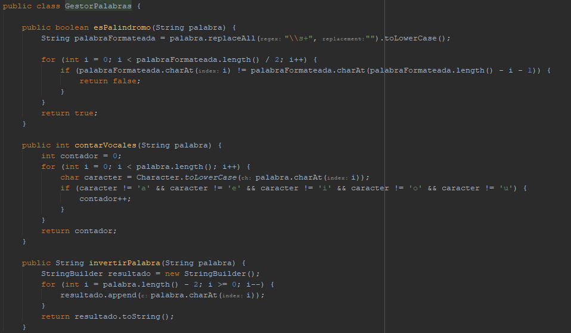
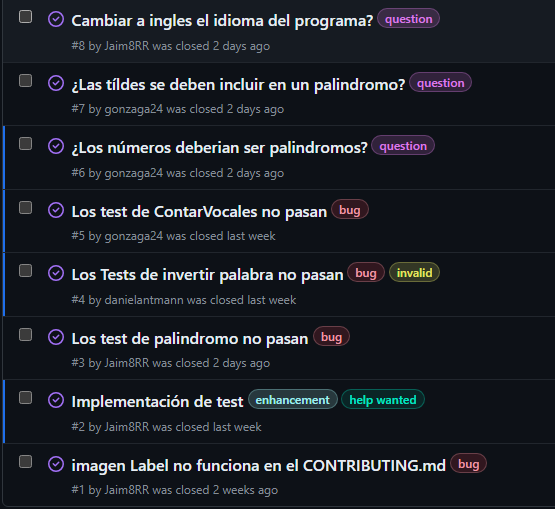
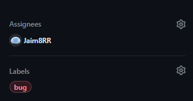
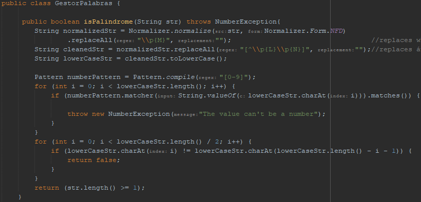
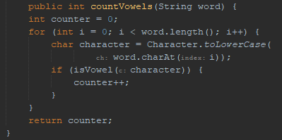
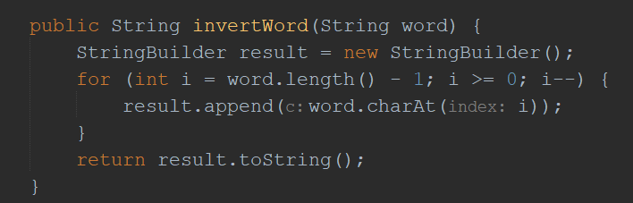

# GestorPalabras
Tarea de hacer test con JUnit a un gestor de palabras en java.

Este trabajo ha sido realizado por: Daniel Antmann, Alex Gonzaga, Marcos Gilson y Jaime Riesgo.

## Diseño de pruebas para una aplicación Java
Para este trabajo hemos obtenido este archivo [GestorPalabras.java](https://ies-europa-rivas.es/moodle/pluginfile.php/108715/mod_assign/introattachment/0/GestorPalabras.java?forcedownload=1)

EL cual en un principio despues de montar unos cuantos test simples se veia que no funcionaba del todo bien. Se ha usado las issues de github para organizarse y ir desarrollando lost tests y decidir especificaciones.

También usamos las [issues](https://github.com/Jaim8RR/GestorPalabras/issues?q=is%3Aissue+is%3Aclosed) para asignar los trabajos a los miembros del equipo y etiquetar que tipo de tarea era.

 

 ## Desarroyo del trabajo
 
 Cada metodo tenia sus fallos, nos dimos cuenta al hacer unos pequeños **test** y viendo que los resultados no eran los esperados:

 ### [Palindromo](https://github.com/Jaim8RR/GestorPalabras/issues/5)

 
   

  El test de palindromo pasaba todos lost test menos los que tenian puntuación modificamos el metodo para que esto no fuera un problema, además también decidimos que los numeros no deberian de ser palindromos ya que mas bien son capicuas. Por lo cual creamos una nueva excepción en la cual si introdujeramos un numero se lanzara.  
  El resultado final fue el siguiente:

  

 ### [Contar Vocales](https://github.com/Jaim8RR/GestorPalabras/issues/5)

 

 El test de contar vocales estaba también mal, para empezar hacia lo contrario, contaba todo menos las vocales, tampoco tenia en cuenta que podian tener tildes.  
 EL resultado final fue el siguiente:

 

 ### [InvertirPalabra](https://github.com/Jaim8RR/GestorPalabras/issues/4)
 
 El fallo de invertir palabra fue el más facil de solucionar, tenia en su codigo un -2 el cual hacia que no se llegase a recorrer toda la String

 Y este fue el resultado final:  

 

 ## Conclusión
 Es importante hacer diferentes test para las cosas que esperas que funcionen y no funcionen las que no deberian funcionar, ya que si no haces varios, puede ocurrir que no des con partes donde tu programa no hace lo esperado, en el caso del palindromo podria parecer que funciona bien al principio si no llegas a usar signos de puntuacion etc, o no metes numeros y te planteas si deberia de funcionar o no, otros como el invertirPalabra darse cuenta de que no funcionaba es rapido podriamos no ver necesario hacer el test pero como un despiste se puede tener siempre es mejor hacerlo para que no nos ocurra como este ejemplo. Mientras que el de contar vocales puedes ver que tiene un error muy rapidamente, algunos si no se han fijado o creado sufientes test y casos de prueba pueden haber ignorado el que metodo no cuenta las vocales con tildes o dieresis.

 

